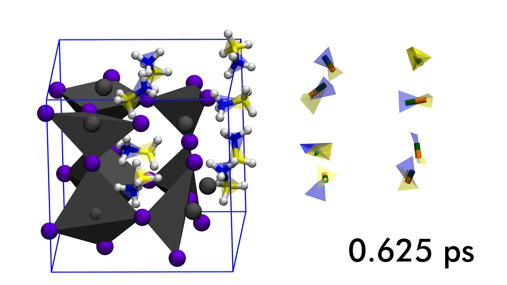

# 2015-MAPI-VMD-MD-renders



A mini Repo just to document some renders I made with VMD of MAPI Molecular Dynamics. Software used was VMD with the Tachyon renderer. "Polyhedra" method was used and abused (mainly abused, as its a bit of a hack job and doesn't treat PBCs correct, or atom selections - so I made subsets of the trajectories that just contained Pb and I).

Please see the VMD 'Visualization State' `visual.vmd` which you can also plunder for the Tcl commands, and the annotate script which used 'convert' from the Imagemagick toolset to add a counter of the simulation time to the bottom right.

## Youtube

Videos look like:
[](http://www.youtube.com/watch?v=PPwSIYLnONY)

And, with varying time speed (achieved by deleting choice subsets of the PNG files; and using a different Glob expression with ffmpeg)
[](http://www.youtube.com/watch?v=K_-rsop0n5A)

## Helpful Coommands

I wrote these useful VMD commands into my lab book as I sorted it out.
```
pbc set {a b c alpha beta gamma} -all
pbc wrap -shiftcenterrel {-0.1 -0.1 -0.1} -all   #bump PBCs to rebuild octahedra across edge
pbc box -color green # Everyone loves a box!
display resize 1920 1080 #Resize to match Youtube HiDef spec; Renders will follow this
```

Everything rendered in the terminal with FFMPEG; I had to up the quality significantly to not degrade the ray traces:
` ffmpeg -framerate 25 -i annotate_MAPI.%05d.png -s:v 1920x1080 -c:v libx264 -profile:v high -crf 18 -pix_fmt yuv420p -r 25 MAPI_salt_cellar_annotate.mp4 `

May your Methylammnium rotate in a manner truly sublime.
Jarv 2015-05-06
